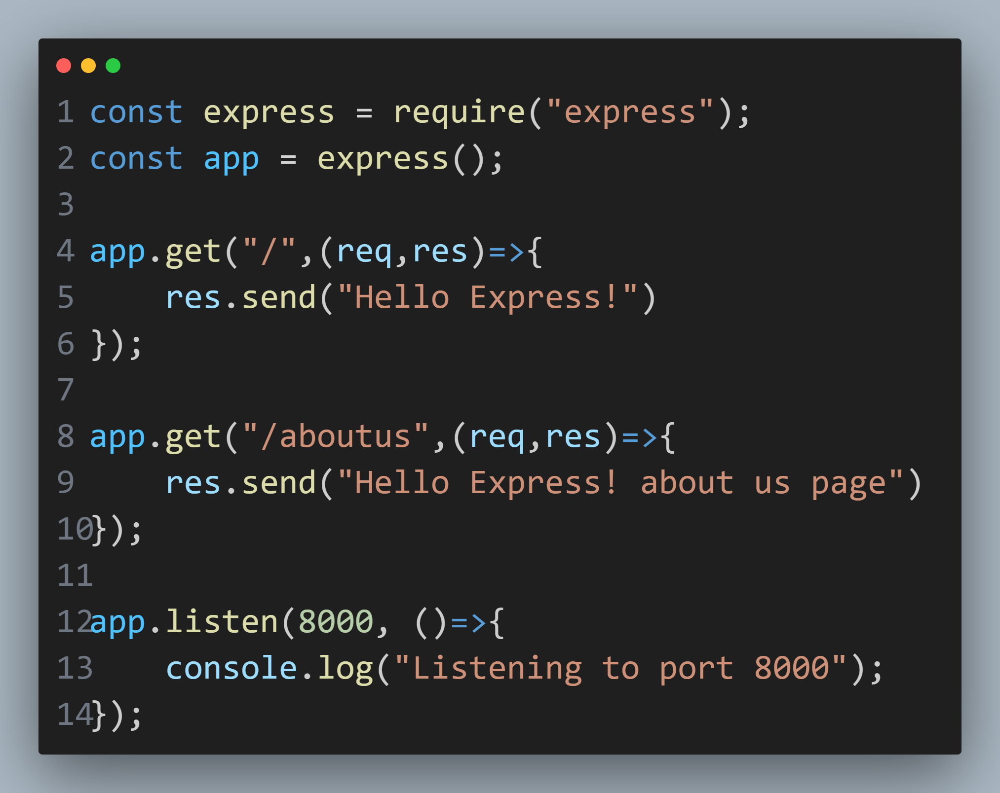
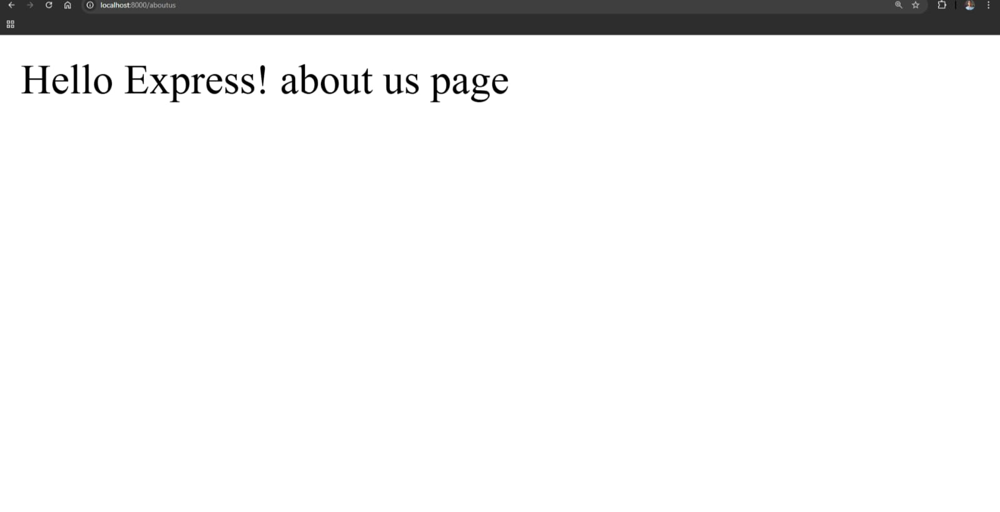
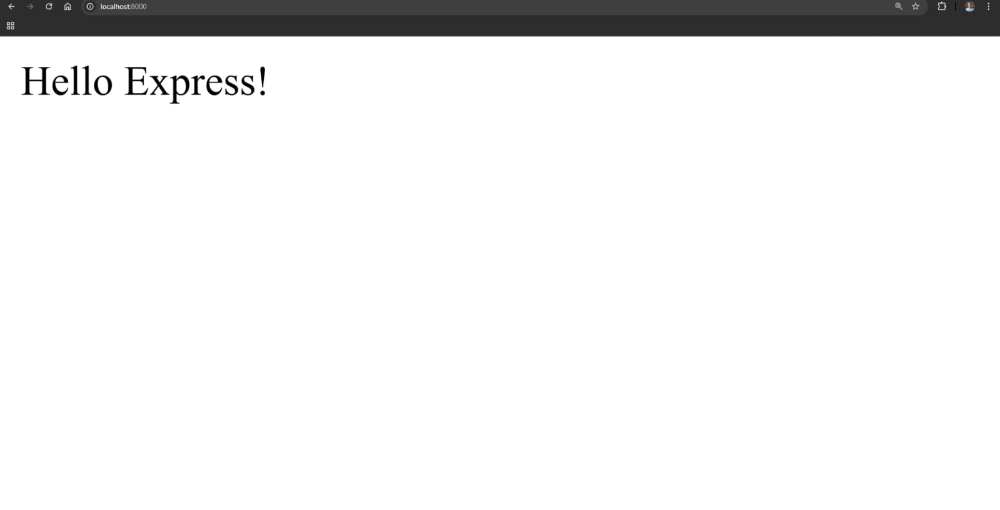

# Express App

---
Here are some images of the app:

|  |  |  |
|------------------------------|------------------------------|------------------------------|
| **Image 1 **       | **Image 2 **       | **Image 3 **       |

---

This is a simple Express.js application that demonstrates the basic usage of Express framework. It includes two routes:

- `/`: A home route that sends a simple "Hello Express!" message.
- `/aboutus`: A route that sends a simple "Hello Express! about us page" message.

